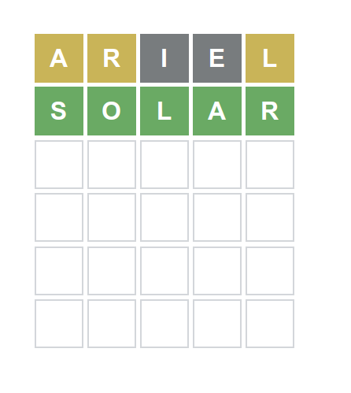
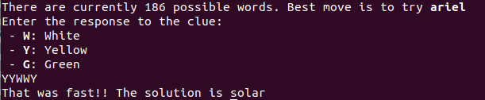

# Fast solver for wordle

This solver for wordle normally works in just **2** or **3** moves

.

It does so by using the shared games by other people. These games reduce a lot the possible solutions and let it win **faaast**.


## How to use it

* Download the repository:

```
git clone git@github.com:furstenheim/wordle.git
cd wordle
go get
```

* Set up the hints that you know. In the file input.txt paste as many hints as you can, the more the merrier. I've included one file as example.

* Run the program. `go run main.go`. This will run the terminal, and interactively add for feedback on some words:

